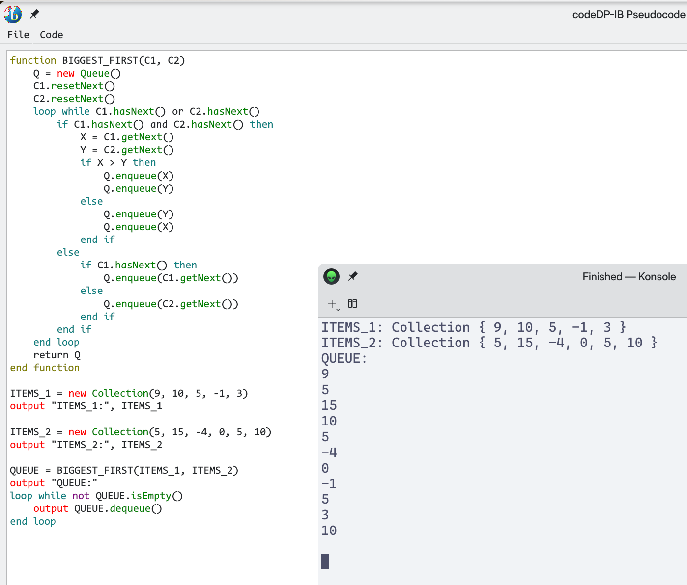

#  CodeDP Pseudocode Editor 

A basic pseudocode editor developed using ibdp_classes and PySide6.

### Screenshots
<p align="center">
  
     <br>
  
 <br>
</p>

### Demo
<p align="center">
  
</p>


## Usage

1. **Run the Application**:
   Execute the script, and the Pseudocode editor window will appear.

2. **Open File**:
   - Click on the "File" menu and select "Open" (`Ctrl+O`).
   - Choose an existing `.ib.bas` file to open and edit.

3. **Save File**:
   - Click on the "File" menu and select "Save" (`Ctrl+S`).
   - If the file is newly created or not saved before, the "Save As" dialog will appear.

4. **Save File As**:
   - Click on the "File" menu and select "Save As" (`Ctrl+Shift+S`).
   - Choose a location and provide a name for the pseudocode file.

5. **Execute Code**:
   - Click on the "Code" menu and select "Execute" (`Ctrl+Return`).
   - The code will be saved to a temporary file, and the `ibdp_classes` module will be executed in a new Python terminal.

## Syntax Highlighting

The syntax highlighting is based on different categories:

- Control Flow (dark cyan)
- Data Structures (dark green)
- Boolean Logic (dark magenta)
- Comparison (dark gray)
- Procedures (dark yellow)
- I/O Operations (red)

## Examples

The editor also comes with example as seen in ibdp_classes.

## Extension

The editor uses .ib.bas extension. The '.bas' is the extension for BASIC which shares similar syntax to the pseudocode. This means you can get syntax highlights and code completion by default in most text editors/IDEs.

## Dependencies Installation

To install the required dependencies install the following libraries in a virtual environment.

```bash
pip install PySide6 ibdp_classes
```

## Todo
- ### FIX THE CODE EXECUTION TERMINAL INSTANCE (ASAP HIGH PRIORITY)
- Fix the UI and Colours (ugly)
- Proper Testing
- Proper Installer
